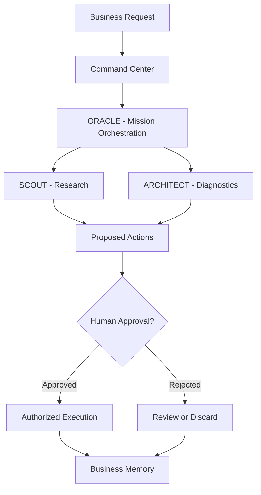

# EXECORA — Conceptual System Diagram

This diagram represents the conceptual architecture of EXECORA. Implementation details and operational status require verification against the private application.
